# Ring Tracker

[](https://github.com/BarishNamazov/garmin-ring-tracker/actions/workflows/ci.yml)

Ring Tracker is a Garmin Connect IQ device app for tracking a NuvaRing schedule on an epix Pro (Gen 2). It records insertion, removal, and temporary-out times; anchors each next action to what actually happened; projects upcoming cycles; keeps cycle history; and posts local reminders.

Current release: **1.3.0**.

> This app is a scheduling aid, not medical advice. It cannot determine whether contraception is effective. Follow the instructions supplied with your ring and contact a qualified clinician or pharmacist if a ring is late, has been out too long, or pregnancy is possible.

## Supported watches

The release contains a separate build for each epix Pro (Gen 2) case size:

| Watch | Connect IQ device ID | Display | Release file |
| --- | --- | ---: | --- |
| epix Pro (Gen 2), 42 mm | `epix2pro42mm` | 390 × 390 | `RingTracker-epix2pro42mm.prg` |
| epix Pro (Gen 2), 47 mm | `epix2pro47mm` | 416 × 416 | `RingTracker-epix2pro47mm.prg` |
| epix Pro (Gen 2), 51 mm | `epix2pro51mm` | 454 × 454 | `RingTracker-epix2pro51mm.prg` |

Garmin's device definitions also use the 47 mm ID for the quatix 7 Pro and the 51 mm ID for the D2 Mach 1 Pro and tactix 7 AMOLED Edition. Those watches share build IDs; the tested support scope of this project is the three epix Pro (Gen 2) sizes.

## Features

- At-a-glance ring-in, ring-free, overdue, and temporary-out status with exact next-action times.
- A read-only glance, six projected Upcoming cycles, confirmed event recording, editable actual dates, and history for up to 24 cycles.
- Hourly background checks and native Garmin notifications for the day before, two same-day reminder slots, overdue actions, extended duration, temporary-out, and ring-free-limit events.
- Watch settings for Reminder 1, optional Reminder 2, the day-before reminder, overdue repeats, foreground sound/vibration, and clinician-directed schedules from 21–35 days in and 0–7 days out. Time display follows the watch's 12/24-hour setting.
- Garmin-style date and time pickers with separate hour, minute, and AM/PM columns, per-minute time selection, live assembled headings, and 12/24-hour formatting.
- Button and touch operation, local on-watch storage, and neutral notification wording.

### Screenshots

| | |
| --- | --- |
| 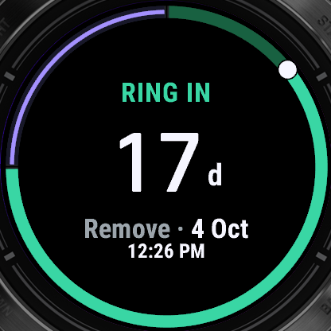<br>**Ring in.** A focused removal countdown and date. | 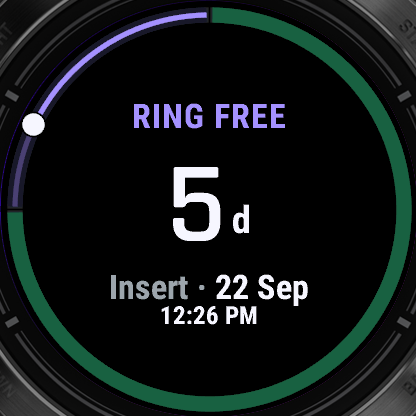<br>**Ring free.** The next insertion countdown and date. |
| 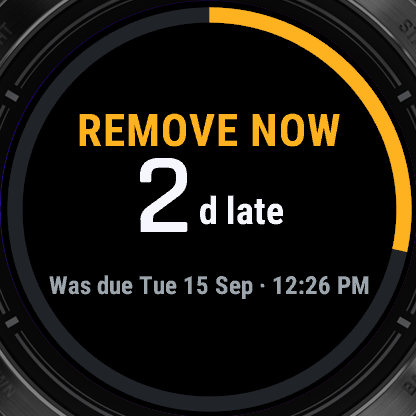<br>**Overdue.** The required action and elapsed time. | 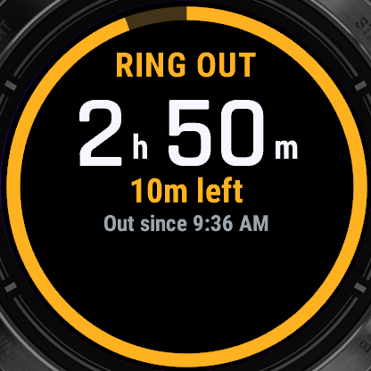<br>**Ring out.** Live elapsed time and the three-hour boundary. |
| 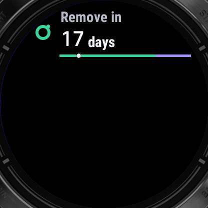<br>**Glance.** Two-row status and a compact cycle bar. | 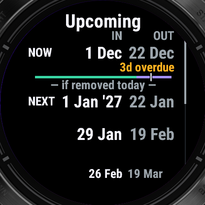<br>**Upcoming.** Fixed in/out columns, current-cycle progress, and six projected cycles. |
| 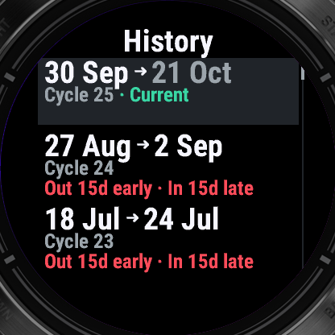<br>**History.** Actual date ranges and per-cycle early/late variance. | 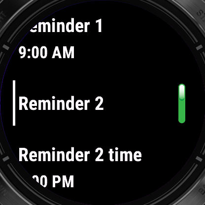<br>**Settings.** Direct toggles, two reminder times, and repeat policy. |
| 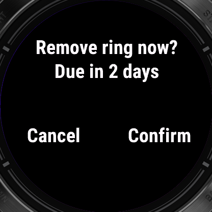<br>**Confirmations.** Early or late event variance is shown before saving. | 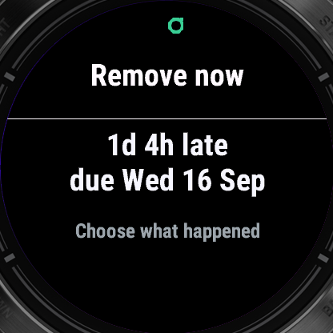<br>**Notifications.** Verb-first native cards with the fact and next step. |
| 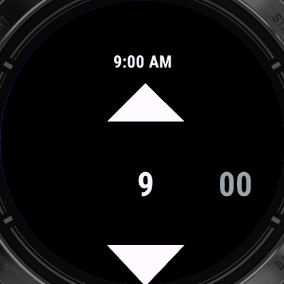<br>**Time.** Separate hour, minute, and AM/PM columns with a live heading. | 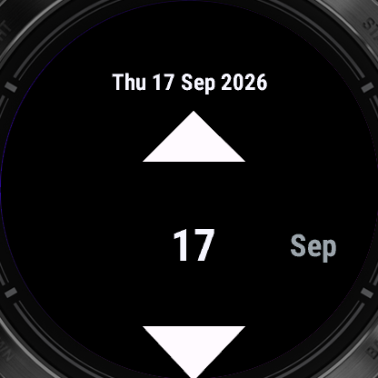<br>**Date.** Day, short month, and year columns with a live weekday heading. |

## Install on your watch

Ring Tracker has been submitted to the Connect IQ Store (listing: <https://apps.garmin.com/apps/5347b9a1-5dd1-4e0a-93bd-b5dcf2a1ef4f>). Until Garmin approves it, install from the release files below.


1. Confirm that the watch is an **epix Pro (Gen 2)** and identify its 42, 47, or 51 mm case size from the original order or box, or by measuring the case body without the buttons. As a technical fallback, open `GARMIN/GarminDevice.xml` over USB and match `PartNumber`: `006-B4312-00` is 42 mm, `006-B4313-00` is 47 mm, and `006-B4314-00` is 51 mm.
2. Download the matching `.prg` from the [latest GitHub Release](https://github.com/BarishNamazov/garmin-ring-tracker/releases/latest), or use the copy in [`release/`](release/). Verify it with the accompanying `SHA256SUMS`. Do not copy `RingTracker.iq`; that package is for Store submission.
3. Quit Garmin Express, BaseCamp, OpenMTP, and any other program that might already be using the watch's MTP connection.
4. On the watch, hold **MENU**, open **System > USB Mode**, and select **MTP**. Connect it to the computer with a USB data cable.
5. Open the watch's internal storage with File Explorer on Windows, OpenMTP on macOS, or an MTP client on Linux.
6. Open the existing `/GARMIN/APPS` directory and copy in the one device-matched `.prg`. Wait for the transfer to finish, close or eject the device, and disconnect it.
7. Wait for app verification, then press **START** from the watch face and open **Ring Tracker** from **Activities & Apps**.
8. Add the glance: hold **MENU**, open **Appearance > Glances > Add**, choose **Ring Tracker**, and return to the watch face.

See the [complete installation guide](docs/INSTALL.md) for Windows, macOS, and Linux details, removal, and troubleshooting.

## Use it on your phone

A USB-sideloaded `.prg` does **not** get an App Settings page in the Connect IQ Store app, Garmin Connect Mobile, or Garmin Express. This is a Garmin Store-association limitation, not a pairing problem. Every Ring Tracker setting is available from **MENU > Settings** on the watch.

If you need phone-side App Settings on your own watch, install the app as a Connect IQ beta under your own Garmin developer account:

1. Sign in to the [Connect IQ developer dashboard](https://apps.garmin.com/developer/dashboard) with the same Garmin account used by the phone and watch.
2. Create a beta submission with an alternate app UUID and upload [`release/RingTracker.iq`](release/RingTracker.iq).
3. Open the beta installation URL shown by the dashboard on the phone and hand it to the Connect IQ Store mobile app.
4. Install and sync the beta to the watch, then open **Ring Tracker > App Settings** in the mobile app.

A beta URL works only for the Garmin account that submitted it; it is not an unlisted distribution link for other testers. The [installation guide](docs/INSTALL.md#if-phone-managed-settings-are-required) explains the beta and public Store routes in detail.

| Phone-editable setting | Accepted value |
| --- | --- |
| Insertion date | Native date control; interpreted as a calendar date, not as a UTC instant |
| Insertion time | 15-minute list in 12-hour AM/PM form |
| Days ring in | `21–35` |
| Days ring-free | `0–7`; `0` means replace immediately |
| Reminder 1 | 15-minute list in 12-hour AM/PM form; always enabled |
| Reminder 2 | On or off; defaults Off |
| Reminder 2 time | 15-minute list in 12-hour AM/PM form; retained while Off |
| Day-before reminder | On or off; uses Reminder 1's time |
| Repeat overdue | `1`, `3`, `6`, `12`, or `24` hours |
| Vibration / sound | On or off; these control foreground feedback after Ring Tracker opens |

Phone settings are configuration only: Ring Tracker has no phone dashboard, phone status push, or phone-generated reminder. Time display always follows the watch's 12/24-hour setting. Watch pickers retain exact minutes. When an exact watch value is mirrored into a 15-minute phone list, only the phone property is rounded to the nearest quarter-hour; the canonical watch value is unchanged. The watch remains the canonical schedule and asks before accepting a changed phone insertion date or time.

## How reminders work

Ring Tracker asks Garmin OS to run a background check about once per hour. Reminder 1 and optional Reminder 2 can notify on the action date; the optional day-before reminder uses Reminder 1's time. When a reminder is due, the watch posts a native notification. Opening it shows the live app state and does not record an event until you choose and confirm an action. Reminders are generated on the watch and do not require a live phone connection.

Garmin background events are approximate and may be deferred or stopped under resource pressure. With an hourly check, a reminder can already be roughly an hour late before any additional OS delay. Do Not Disturb, Sleep Mode, and the watch's Sound and Vibe settings also affect presentation. Ring Tracker is not a substitute for a phone alarm or another independent reminder for a time-critical contraceptive action.

The app's vibration and sound switches apply only after an alert opens in the foreground. Garmin OS controls sound and vibration for the native background notification.

## Using the app

On first run, read the safety text and choose **I understand**, review the default **21 days in / 7 days out** regimen, and record the actual insertion date and time. Choose **Insert now** only when the insertion just happened; otherwise use **Choose date & time**.

Open the main menu to choose **Insert ring**, **Remove ring**, or **Ring out briefly**. While a temporary-out timer is open, use **START** or **Put ring back** when the ring is reinserted. Every state-changing action has a confirmation. The confirmed actual removal anchors the next insertion date, and the confirmed actual insertion anchors the next removal date. Use **Correct dates** to correct only actual insertion or removal timestamps instead of recording a false event. **History** shows archived cycles, early/late variance, and retained temporary-out records; deleting history also requires confirmation.

All settings can be changed on the watch. Ring Tracker is for NuvaRing only. Non-default schedules support clinician-directed plans of 21–35 days in and 0–7 days out. The app does not recommend an extended plan: it requires an acknowledgement, treats zero ring-free days as immediate replacement, and marks 29–35 days as outside the FDA-labelled duration. Read [the regimen model and source notes](docs/REGIMEN.md) before using a non-default plan.

| Input | Main screen | Menus, pickers, and dialogs |
| --- | --- | --- |
| **START/ENTER** or tap | Open the context menu; while temporarily out, open the Put ring back confirmation | Select or confirm |
| **BACK/LAP** or swipe right | Exit the app | Go to the preceding picker column, then cancel or go back without saving |
| **UP** or swipe down | Open Upcoming | Move, scroll, or change a value |
| **DOWN** or swipe up | Open History | Move, scroll, or change a value |
| Hold **UP/MENU** | Open the context menu | Open a context menu when available |
| **LIGHT** | Garmin system behavior | Garmin system behavior |

## Build from source

Install the Garmin Connect IQ SDK, Java, the three device definitions, simulator fonts for visual testing, and a private PKCS#8 developer key. The verified environment uses Connect IQ SDK 9.2.0 and OpenJDK 17; [the toolchain guide](docs/TOOLCHAIN.md) documents setup, paths, signing, device definitions, and simulator use.

After configuring `scripts/env.sh`, run:

```bash
./scripts/build.sh release
./scripts/build.sh debug
./scripts/build.sh test
```

- `release` writes three signed PRGs and the Store package to `bin/release/`.
- `debug` writes three PRGs to `bin/debug/`; its on-watch **Demo scenarios** menu can open 12-hour, 24-hour, and date pickers and seed first-run, main/list boundaries, temporary-out, warning, menu/settings, notification, migration, maximum-history, Alert-detail, and background-event states. In the simulator object-store editor, set numeric epoch seconds at `debugNowUtc` to override the clock, or remove the key to resume real time.
- `test` builds `bin/test/RingTracker-tests.prg`, starts a headless simulator when needed, and fails if the test summary reports failures or errors.

Build output under `bin/` is ignored. The checked-in install bundle under `release/` is copied from a verified release build.

## Project layout

```text
.
├── release/                 Installable PRGs, Store package, and checksums
├── source/                  Monkey C app, domain, persistence, glance, and service
│   └── tests/               Simulator unit and regression tests
├── resources/               Strings, settings schema, and vector assets
├── resources-debug/         Debug-only strings
├── scripts/                 Build and local SDK environment helpers
├── docs/                    User, product, design, toolchain, and QA records
├── manifest.xml             App identity, products, permissions, and minimum API
├── monkey*.jungle           Release, debug, and test build configurations
├── CHANGELOG.md             Versioned release notes
└── LICENSE                  MIT license
```

## Documentation

Release history is recorded in [CHANGELOG.md](CHANGELOG.md).

- [INSTALL.md](docs/INSTALL.md) — end-user sideloading, first-run setup, glance setup, removal, and troubleshooting.
- [PUBLISHING.md](docs/PUBLISHING.md) — repository setup, signing-key custody, GitHub releases, and manual Connect IQ Store submission.
- [IMPLEMENTATION.md](docs/IMPLEMENTATION.md) — implementation map, build variants, tests, memory evidence, and resolved review findings.
- [REGIMEN.md](docs/REGIMEN.md) — medical schedule boundaries, supported regimen, warnings, source material, and review requirement.
- [REVIEW.md](docs/REVIEW.md) — independent review findings and the regression cases subsequently resolved in the implementation.
- [SPEC.md](docs/SPEC.md) — product contract, data model, schedule calculations, background policy, settings, and release gates.
- [SPEC-1.1.md](docs/SPEC-1.1.md) — v1.1 delta contract for copy, reminders, actual-event anchors, Upcoming, Main, migration, and verification.
- [REVIEW-2.md](docs/REVIEW-2.md) — second-round findings and the regression cases resolved in v1.1.
- [TOOLCHAIN.md](docs/TOOLCHAIN.md) — reproducible SDK, Java, device-definition, font, signing, and simulator setup.
- [UI.md](docs/UI.md) — layouts, visual states, navigation, accessibility, and interaction flows.
- [devices/](docs/devices/) — pinned compiler-definition snapshots for the three target IDs.
- [screenshots/](docs/screenshots/) — native-resolution simulator captures used in the gallery and QA.
- [toolchain-font-proof.png](docs/toolchain-font-proof.png) — simulator font-rendering proof recorded during toolchain setup.

## License

Ring Tracker is available under the [MIT License](LICENSE). Copyright © 2026 Barish Namazov.
